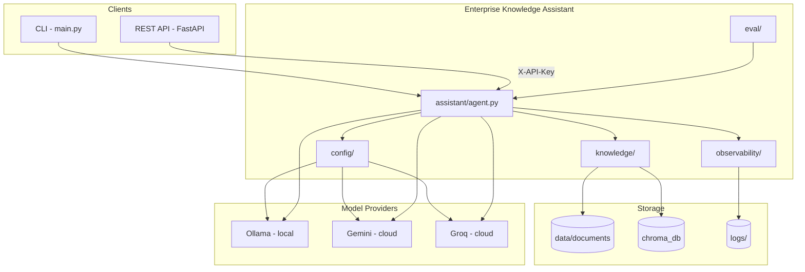
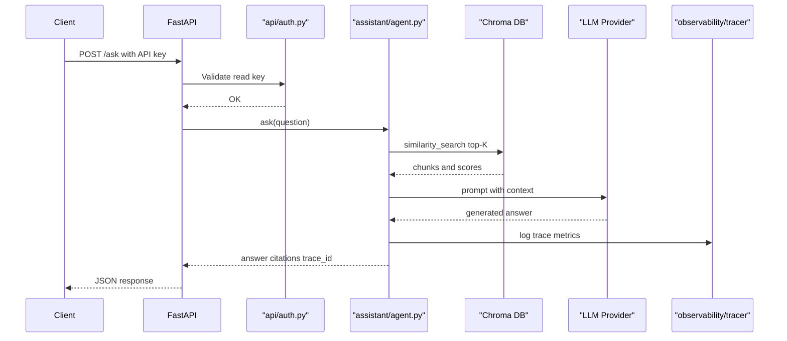
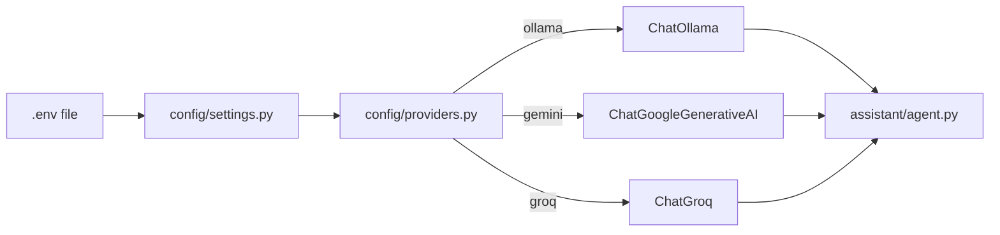
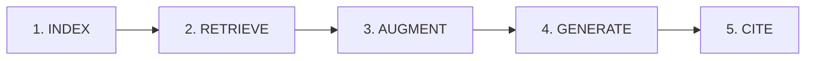
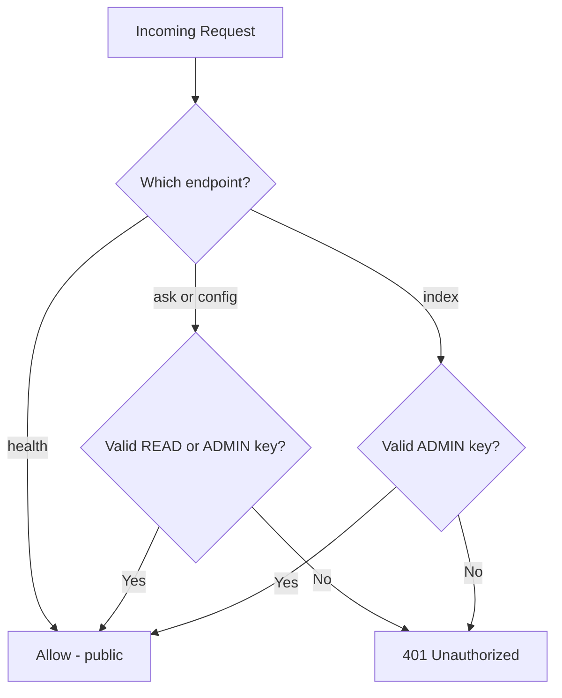
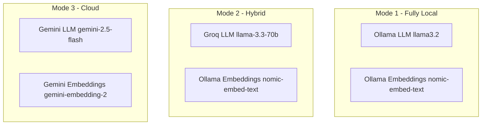

# Enterprise Knowledge Assistant

[Python 3.11+](https://www.python.org/downloads/)
[License: MIT](LICENSE)
[RAG](https://python.langchain.com/)
[FastAPI](https://fastapi.tiangolo.com/)

A **production-style RAG (Retrieval-Augmented Generation) system** that answers questions from your internal documents with **source citations**, **structured observability**, and **API authentication**.

Designed for **open-source models** (Ollama / Llama) with optional cloud providers (Gemini, Groq). Switch between local and cloud execution via environment variables — no code changes required.

> **Diagrams:** Mermaid blocks render on [GitHub](https://github.com). In VS Code / Cursor, install the **Markdown Preview Mermaid Support** extension, or view the README on GitHub for rendered diagrams.

---

## Table of Contents

- [Features](#features)
- [Architecture](#architecture)
- [System Components](#system-components)
- [RAG Pipeline](#rag-pipeline)
- [Project Structure](#project-structure)
- [Quick Start](#quick-start)
- [Configuration](#configuration)
- [CLI Reference](#cli-reference)
- [REST API](#rest-api)
- [Authentication](#authentication)
- [Observability](#observability)
- [Evaluation](#evaluation)
- [Model Providers](#model-providers)
- [Docker](#docker)
- [Development](#development)
- [Roadmap](#roadmap)
- [Documentation](#documentation)

---

## Features


| Category          | Capability                                                   |
| ----------------- | ------------------------------------------------------------ |
| **RAG**           | Index → Retrieve → Augment → Generate with citations         |
| **Documents**     | `.txt`, `.md`, `.pdf` ingestion                              |
| **Vector store**  | Persistent Chroma DB (survives restarts)                     |
| **Models**        | Ollama (local), Gemini, Groq — swappable via `.env`          |
| **Interfaces**    | CLI + FastAPI REST API                                       |
| **Auth**          | Read/admin API keys with role separation                     |
| **Observability** | Structured traces, latency breakdown, `trace_id` correlation |
| **Evaluation**    | Automated test suite with pass rate metrics                  |
| **Config**        | Environment-driven, fail-fast validation                     |


---

## Architecture

### High-Level System Diagram




ASCII fallback (if Mermaid does not render)

```
  CLI / API ──► Enterprise Knowledge Assistant
                      │
        ┌─────────────┼─────────────┐
        ▼             ▼             ▼
     config/     knowledge/   observability/
        │             │
        ▼             ▼
   Ollama/Gemini   data/documents + chroma_db
   Groq
```


### Request Flow (`POST /ask`)




ASCII fallback (if Mermaid does not render)

```
Client → API → Auth → Agent → Chroma (retrieve chunks)
                          → LLM (generate answer)
                          → Trace (log metrics)
                API → Client (JSON + trace_id)
```


### Provider Abstraction




ASCII fallback (if Mermaid does not render)

```
.env → settings.py → providers.py → ChatOllama / ChatGemini / ChatGroq → agent.py
```


---

## System Components

Every module in this project has a single responsibility. Below is what each component does and why it exists.

### `main.py` — CLI Entry Point

Interactive command-line interface for local development and demos.


| Command                          | Description                 |
| -------------------------------- | --------------------------- |
| `python main.py`                 | Start interactive chat      |
| `python main.py index`           | Index documents into Chroma |
| `python main.py index --rebuild` | Wipe and re-index           |
| `python main.py info`            | Show active model providers |
| `python main.py eval`            | Run evaluation test suite   |


---

### `config/` — Configuration Layer

Centralizes all environment-based settings. No hardcoded secrets or provider logic elsewhere.


| File           | Responsibility                                              |
| -------------- | ----------------------------------------------------------- |
| `settings.py`  | Load `.env`, validate API keys, expose `Settings` dataclass |
| `providers.py` | Factory functions: `get_llm()`, `get_embeddings()`          |


**Design pattern:** Strategy / Factory — swap LLM or embedding backends without touching RAG logic.

---

### `knowledge/` — Document Ingestion & Indexing

Handles the **indexing** phase of RAG (offline / on startup).


| File         | Responsibility                                          |
| ------------ | ------------------------------------------------------- |
| `loader.py`  | Load `.txt`, `.md`, `.pdf` files from `data/documents/` |
| `indexer.py` | Split into chunks → embed → store in Chroma             |


**Pipeline:**

```
Documents → RecursiveCharacterTextSplitter → Embeddings → Chroma (persistent)
```

Configurable via `CHUNK_SIZE`, `CHUNK_OVERLAP`, `TOP_K`.

---

### `assistant/` — RAG Orchestrator

The core agent that runs the online RAG pipeline per question.


| File       | Responsibility                                                     |
| ---------- | ------------------------------------------------------------------ |
| `agent.py` | `EnterpriseKnowledgeAssistant` — retrieve, augment, generate, cite |


**Key methods:**

- `index()` — trigger document indexing
- `ask(question)` — full RAG pipeline with timing + trace logging

**Output:** `AssistantResponse` with answer, citations, `trace_id`, latency metrics.

---

### `api/` — REST API Layer

Production HTTP interface built on FastAPI.


| File        | Responsibility                                    |
| ----------- | ------------------------------------------------- |
| `server.py` | Endpoints: `/health`, `/config`, `/ask`, `/index` |
| `auth.py`   | API key validation (read vs admin roles)          |


**Auth model:**

- `API_READ_KEY` → `/ask`, `/config`
- `API_ADMIN_KEY` → `/index` (destructive operations)
- `/health` → always public (load balancer probes)

---

### `observability/` — Tracing & Logging

Structured observability for debugging RAG quality and performance.


| File        | Responsibility                               |
| ----------- | -------------------------------------------- |
| `tracer.py` | `RequestTrace`, JSON logging, latency timers |


**Logged per request:**

- `trace_id`, `retrieval_ms`, `generation_ms`, `total_ms`
- Retrieved chunks (source, score, excerpt)
- Model provider info

**Output files:**


| File                | Format                                       |
| ------------------- | -------------------------------------------- |
| `logs/traces.jsonl` | Machine-readable JSON (one line per request) |
| `logs/app.log`      | Human-readable summary                       |


---

### `eval/` — Quality Evaluation Suite

Automated regression testing for RAG answer quality.


| File              | Responsibility                                        |
| ----------------- | ----------------------------------------------------- |
| `test_cases.json` | 7 test Q&A pairs (6 factual + 1 refusal)              |
| `runner.py`       | Score keyword coverage, source hits, refusal behavior |


**Metrics:** pass rate, keyword coverage, citation accuracy, latency.

**Run:** `python main.py eval -v`

Results saved to `eval/results/latest.json`.

---

### `data/` — Knowledge Base


| Path              | Purpose                                  |
| ----------------- | ---------------------------------------- |
| `data/documents/` | Source documents (`.txt`, `.md`, `.pdf`) |
| `data/result.txt` | Last CLI response (gitignored)           |


---

### `chroma_db/` — Vector Store (auto-created)

Persistent embedding index. **Must re-index** when switching embedding providers (different vector spaces).

---

## RAG Pipeline




ASCII fallback (if Mermaid does not render)

```
INDEX → RETRIEVE → AUGMENT → GENERATE → CITE
```


| Step         | What happens                                    | Code                                     |
| ------------ | ----------------------------------------------- | ---------------------------------------- |
| **Index**    | Documents chunked and embedded into Chroma      | `knowledge/indexer.py`                   |
| **Retrieve** | Question embedded; top-K similar chunks fetched | `assistant/agent.py::_retrieve()`        |
| **Augment**  | Chunks + question assembled into RAG prompt     | `assistant/agent.py::_build_prompt()`    |
| **Generate** | LLM answers using only provided context         | `assistant/agent.py::ask()`              |
| **Cite**     | Source files and relevance scores returned      | `assistant/agent.py::_build_citations()` |


---

## Project Structure

```
enterprise-knowledge-assistant/
│
├── main.py                         # CLI entry point
├── requirements.txt                # Python dependencies
├── docker-compose.yml              # Ollama container (optional)
├── .env.example                    # Configuration template
├── plan.md                         # Interview presentation guide
│
├── config/                         # Configuration & provider abstraction
│   ├── settings.py                 #   Environment loading + validation
│   └── providers.py                #   LLM / embedding factories
│
├── knowledge/                        # Document ingestion
│   ├── loader.py                   #   Load txt / md / pdf
│   └── indexer.py                  #   Chunk + embed + Chroma storage
│
├── assistant/                        # RAG orchestration
│   └── agent.py                    #   Retrieve → augment → generate
│
├── api/                            # REST API
│   ├── server.py                   #   FastAPI endpoints
│   └── auth.py                     #   API key middleware
│
├── observability/                  # Tracing & logging
│   └── tracer.py                   #   Structured JSON traces
│
├── eval/                           # Quality evaluation
│   ├── test_cases.json             #   Test Q&A dataset
│   ├── runner.py                   #   Scoring engine
│   └── results/                    #   Eval reports (gitignored)
│
├── data/
│   └── documents/                  # Knowledge base files
│
├── chroma_db/                      # Persistent vector store (gitignored)
└── logs/                           # Trace logs (gitignored)
```

---

## Quick Start

### Prerequisites

- Python 3.11+
- [Ollama](https://ollama.com) (for local mode) **or** Gemini/Groq API keys (for cloud mode)

### 1. Clone & install

```bash
git clone <your-repo-url>
cd simpleAgent

python -m venv venv
source venv/bin/activate          # Windows: venv\Scripts\activate
pip install -r requirements.txt
cp .env.example .env
```

### 2. Configure providers

Edit `.env` — choose a preset:

**Fully local (open-source, private):**

```env
LLM_PROVIDER=ollama
EMBEDDING_PROVIDER=ollama
```

```bash
ollama pull llama3.2:3b
ollama pull nomic-embed-text
```

**All cloud Gemini (easiest):**

```env
LLM_PROVIDER=gemini
EMBEDDING_PROVIDER=gemini
GEMINI_API_KEY=your-key
```

### 3. Add documents

Place files in `data/documents/` (`.txt`, `.md`, `.pdf`).

A sample knowledge base is included: `data/documents/company_knowledge.md`

### 4. Run

```bash
python main.py info               # verify configuration
python main.py index --rebuild    # build vector index
python main.py                    # start interactive chat
python main.py eval -v            # run quality evaluation
```

### 5. Start API server

```bash
uvicorn api.server:app --reload --port 8000
```

```bash
curl -X POST http://localhost:8000/ask \
  -H "Content-Type: application/json" \
  -H "X-API-Key: your-read-key" \
  -d '{"question": "What is RAG?"}'
```

---

## Configuration

All settings are loaded from `.env`. See `[.env.example](.env.example)` for the full template.

### Provider Selection


| Variable             | Options                    | Description                       |
| -------------------- | -------------------------- | --------------------------------- |
| `LLM_PROVIDER`       | `ollama`, `gemini`, `groq` | Chat / generation model           |
| `EMBEDDING_PROVIDER` | `ollama`, `gemini`         | Embedding model for vector search |


### Model Settings


| Variable                 | Default                     | Description           |
| ------------------------ | --------------------------- | --------------------- |
| `OLLAMA_LLM_MODEL`       | `llama3.2:3b`               | Local chat model      |
| `OLLAMA_EMBEDDING_MODEL` | `nomic-embed-text`          | Local embedding model |
| `GEMINI_LLM_MODEL`       | `gemini-2.5-flash`          | Cloud chat model      |
| `GEMINI_EMBEDDING_MODEL` | `models/gemini-embedding-2` | Cloud embedding model |
| `GROQ_LLM_MODEL`         | `llama-3.3-70b-versatile`   | Groq chat model       |


### RAG Tuning


| Variable        | Default | Description                   |
| --------------- | ------- | ----------------------------- |
| `CHUNK_SIZE`    | `500`   | Characters per document chunk |
| `CHUNK_OVERLAP` | `50`    | Overlap between chunks        |
| `TOP_K`         | `4`     | Chunks retrieved per question |


### API & Security


| Variable           | Default | Description                   |
| ------------------ | ------- | ----------------------------- |
| `API_AUTH_ENABLED` | `true`  | Enable API key authentication |
| `API_READ_KEY`     | —       | Key for `/ask`, `/config`     |
| `API_ADMIN_KEY`    | —       | Key for `/index`              |
| `LOG_LEVEL`        | `INFO`  | Logging verbosity             |


> **Important:** Re-index (`python main.py index --rebuild`) after switching `EMBEDDING_PROVIDER` — embeddings from different models are not compatible.

---

## CLI Reference

```bash
python main.py [command] [options]
```


| Command | Options                  | Description                     |
| ------- | ------------------------ | ------------------------------- |
| `chat`  | —                        | Interactive Q&A (default)       |
| `index` | `--rebuild`              | Index documents into Chroma     |
| `info`  | —                        | Show active providers and paths |
| `eval`  | `-v`, `--test-file PATH` | Run evaluation suite            |


**Chat commands:** `reindex` (rebuild index), `exit` (quit).

---

## REST API

Start the server:

```bash
uvicorn api.server:app --reload --host 0.0.0.0 --port 8000
```

Interactive docs: [http://localhost:8000/docs](http://localhost:8000/docs)

### Endpoints


| Endpoint  | Method | Auth   | Description                     |
| --------- | ------ | ------ | ------------------------------- |
| `/health` | GET    | Public | Health check for load balancers |
| `/config` | GET    | Read   | Active model providers          |
| `/ask`    | POST   | Read   | Ask a question                  |
| `/index`  | POST   | Admin  | Index / re-index documents      |


### `POST /ask`

**Request:**

```json
{
  "question": "What model providers are supported?"
}
```

**Response:**

```json
{
  "answer": "This project supports Ollama, Gemini, and Groq...",
  "citations": [
    {
      "source": "data/documents/company_knowledge.md",
      "excerpt": "Supported Model Modes...",
      "score": 0.54
    }
  ],
  "provider_info": {
    "llm_provider": "ollama",
    "llm_model": "llama3.2:3b",
    "embedding_provider": "ollama",
    "embedding_model": "nomic-embed-text",
    "mode": "local"
  },
  "trace_id": "b01711e1",
  "retrieval_ms": 1391.9,
  "generation_ms": 12139.3,
  "total_ms": 13532.0
}
```

### `POST /index?rebuild=false`

**Auth:** Admin key required.

Triggers document indexing. Set `rebuild=true` to wipe and re-index.

---

## Authentication




ASCII fallback (if Mermaid does not render)

```
/health     → public (no key)
/ask        → requires READ or ADMIN key
/config     → requires READ or ADMIN key
/index      → requires ADMIN key only
```


Configure in `.env`:

```env
API_AUTH_ENABLED=true
API_READ_KEY=your-read-key
API_ADMIN_KEY=your-admin-key
```


| Key             | Grants access to                      |
| --------------- | ------------------------------------- |
| `API_READ_KEY`  | `GET /config`, `POST /ask`            |
| `API_ADMIN_KEY` | All endpoints including `POST /index` |


Set `API_AUTH_ENABLED=false` for local development without keys.

---

## Observability

Every `ask` and `index` operation emits a structured trace.

### Trace fields


| Field           | Description                                           |
| --------------- | ----------------------------------------------------- |
| `trace_id`      | Short UUID — returned in API response for correlation |
| `retrieval_ms`  | Vector search latency                                 |
| `generation_ms` | LLM inference latency                                 |
| `total_ms`      | End-to-end request time                               |
| `chunks`        | Retrieved passages with source, score, excerpt        |
| `provider_info` | Active LLM and embedding provider                     |


### Log files

```
logs/
├── traces.jsonl    # One JSON object per line (machine-readable)
└── app.log         # Human-readable summaries
```

### Debugging a bad answer

1. Copy `trace_id` from the API response
2. Search `logs/traces.jsonl` for that ID
3. Inspect which chunks were retrieved and their scores
4. Check if retrieval or generation is the bottleneck via `retrieval_ms` vs `generation_ms`

---

## Evaluation

Built-in regression suite to measure RAG quality over time.

```bash
python main.py eval        # summary report
python main.py eval -v     # per-question details
```

### Metrics


| Metric           | Description                       | Pass threshold |
| ---------------- | --------------------------------- | -------------- |
| Keyword coverage | Expected terms found in answer    | ≥ 60%          |
| Source hit       | Correct document cited            | Required       |
| Refusal check    | Unknown questions declined safely | Required       |
| Latency          | Seconds per question              | Informational  |


### Test cases

Defined in `[eval/test_cases.json](eval/test_cases.json)` — 7 cases covering factual Q&A and hallucination refusal.

Results saved to `eval/results/latest.json`.

---

## Model Providers

### Deployment modes




ASCII fallback (if Mermaid does not render)

```
Local:  Ollama LLM + Ollama Embeddings
Hybrid: Groq LLM + Ollama Embeddings
Cloud:  Gemini LLM + Gemini Embeddings
```


### Recommended models


| Role       | Local (Ollama)     | Cloud                          |
| ---------- | ------------------ | ------------------------------ |
| Fast chat  | `llama3.2:3b`      | Groq `llama-3.1-8b-instant`    |
| Quality    | `qwen2.5:7b`       | Groq `llama-3.3-70b-versatile` |
| Embeddings | `nomic-embed-text` | Gemini `gemini-embedding-2`    |


### API key sources (free tiers)


| Provider      | Get key                                                          |
| ------------- | ---------------------------------------------------------------- |
| Google Gemini | [aistudio.google.com/apikey](https://aistudio.google.com/apikey) |
| Groq          | [console.groq.com](https://console.groq.com)                     |
| Ollama        | No key — runs locally                                            |


---

## Docker

Run Ollama as a container (optional):

```bash
docker compose up -d ollama
ollama pull llama3.2:3b
ollama pull nomic-embed-text
```

Set in `.env`:

```env
OLLAMA_BASE_URL=http://localhost:11434
```

---

## Development

### Prerequisites

```bash
pip install -r requirements.txt
cp .env.example .env
```

### Run tests

```bash
python main.py eval -v
```

### Project conventions

- **Config-driven** — all provider switching via `.env`, not code
- **Factory pattern** — `config/providers.py` creates model instances
- **Structured logging** — JSON traces in `logs/traces.jsonl`
- **Fail-fast validation** — placeholder API keys caught at startup

### Adding a new document

1. Drop file into `data/documents/`
2. `python main.py index --rebuild`
3. Verify with `python main.py eval`

### Adding a new test case

Edit `eval/test_cases.json`:

```json
{
  "id": "my_test",
  "question": "What is our refund policy?",
  "expected_keywords": ["refund", "30 days"],
  "expected_source_contains": "policies.md",
  "must_refuse": false
}
```

---

## Roadmap

- [x] RAG pipeline with citations
- [x] Multi-provider support (Ollama / Gemini / Groq)
- [x] Persistent Chroma vector store
- [x] FastAPI REST API
- [x] API authentication (read / admin keys)
- [x] Structured observability (traces + latency)
- [x] Evaluation suite
- [ ] Conversation memory (multi-turn)
- [ ] Reranking (cross-encoder)
- [ ] Document upload API
- [ ] Docker full-stack deploy
- [ ] Web UI (Streamlit / Next.js)

---

## Documentation


| Document                     | Description                                    |
| ---------------------------- | ---------------------------------------------- |
| [README.md](README.md)       | This file — setup, architecture, API reference |
| [plan.md](plan.md)           | Interview presentation guide                   |
| [.env.example](.env.example) | Full configuration reference                   |


---

## License

MIT License — see [LICENSE](LICENSE) for details.

---

## Acknowledgments

Built with [LangChain](https://langchain.com), [Chroma](https://www.trychroma.com), [FastAPI](https://fastapi.tiangolo.com), and [Ollama](https://ollama.com).